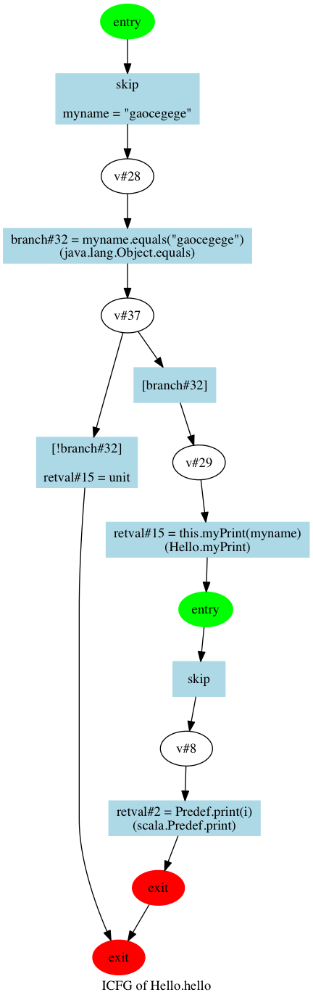

# Yet Another Insane

YAI是基于[INSANE](https://github.com/colder/insane)的，过程间Control Flow Graph生成器。给定一个scala文件，可以对其进行静态分析，产生相应的过程间控制流图。

## 示例

### 代码

	object Hello {
		def myPrint(i:String) = {
			print(i)
		}
		def hello() = {
			var myname = "gaocegege"
			if (myname == "gaocegege"){
				myPrint(myname)
			}

		}
	}

### ICFG

<figure>
	
</figure>

## Use

可以使用`./workscripts/`下的脚本进行生成。

### 生成icfg的dot文件

	./workscripts/auto.sh <your scala file>

### 根据dot文件进行绘制

	./workscripts/draw2png.sh <your dot file>

### clean

	./workscripts/clear.sh

## TODO and BUGLIST

1. [Solved] 如果有print函数，就会报错，不知道使用其他的内置函数会不会有同样的问题，待测试
2. 希望可以添加函数框来表明调用的是什么函数，这样图的可读性会好很多

## Author

* [Ce Gao](https://github.com/gaocegege)
* [Haonan Fu](https://github.com/fhnstephen)
* [Tianyu Xiang](https://github.com/xiangtianyu)